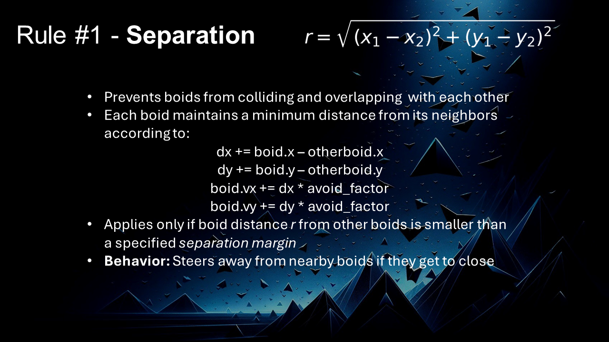

# Boids Flocking Algorithm

Boids Flocking algorithm was developed by Craig Reynolds in 1986. It uses three simple rules to reflect a complex behavior of modeling the natural movement of flocks, herds and schools of animals. This project uses three *Python* packages: *Pygame, PyMunk and Thorpy*.

Below we can see two animations and presentation slides from seminars at my University.

# Animations

# Presentation Slides

